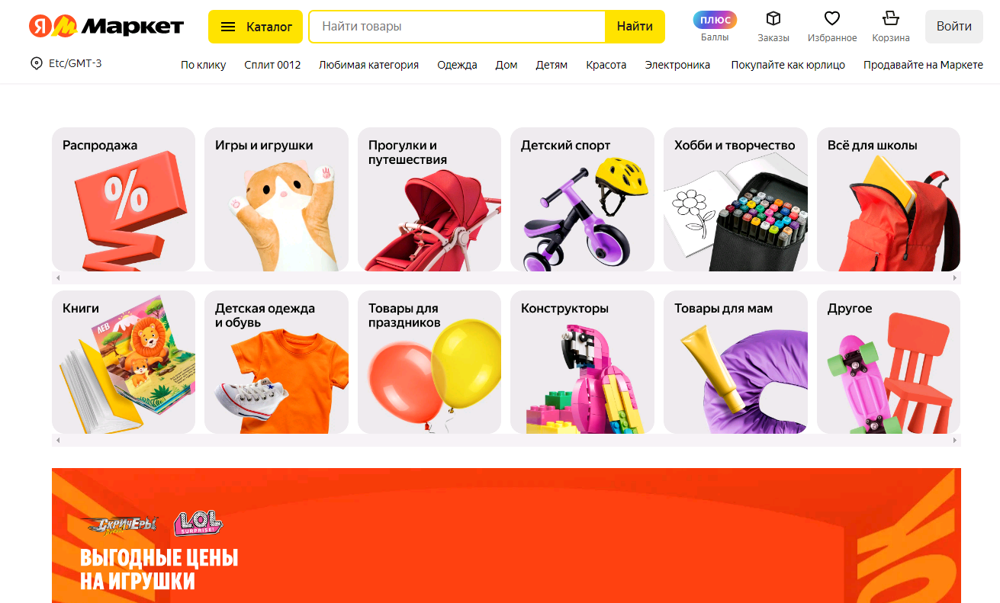
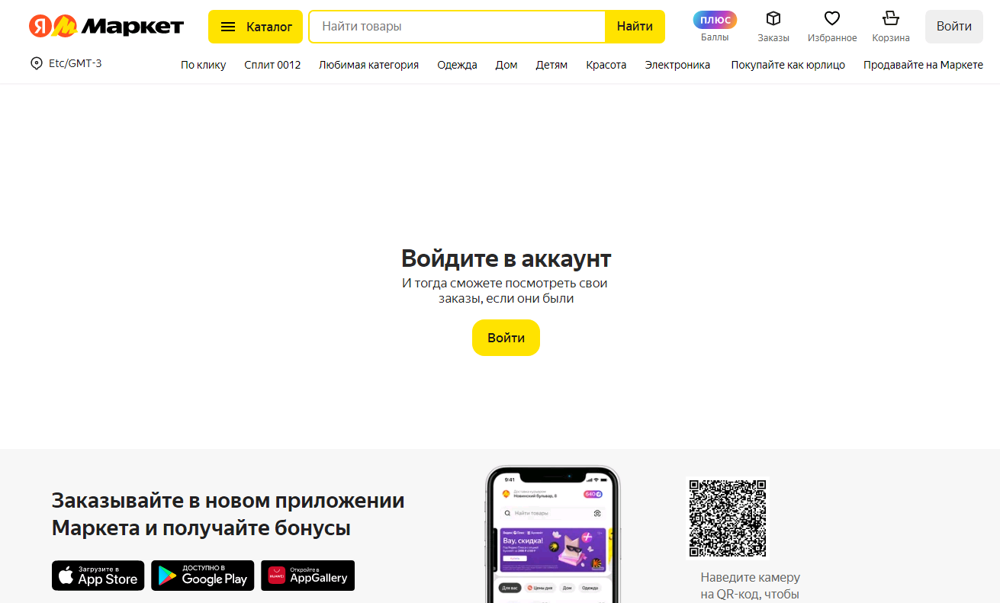
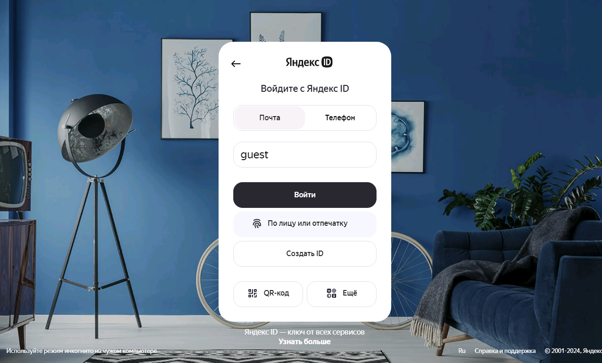
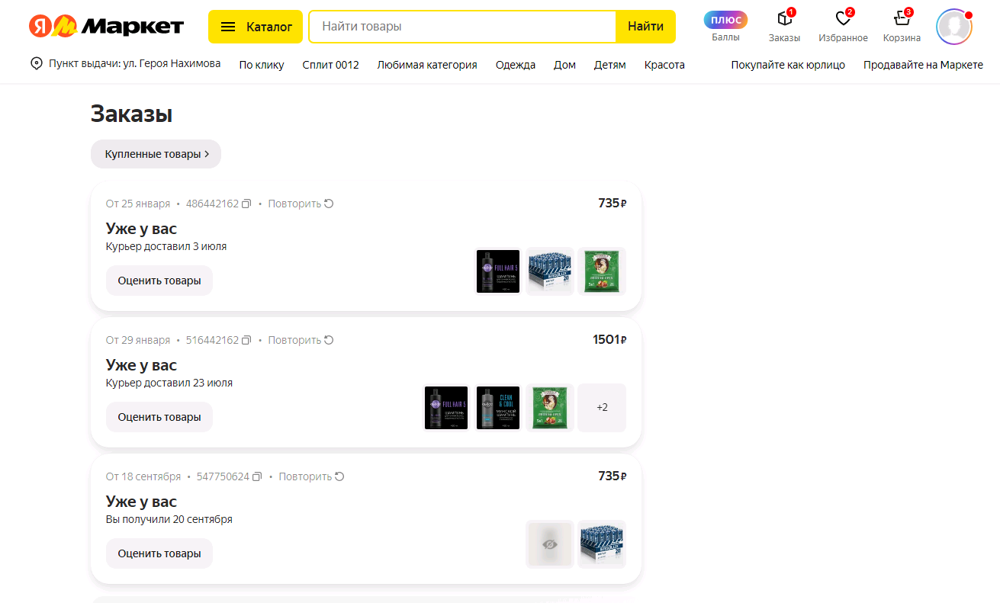
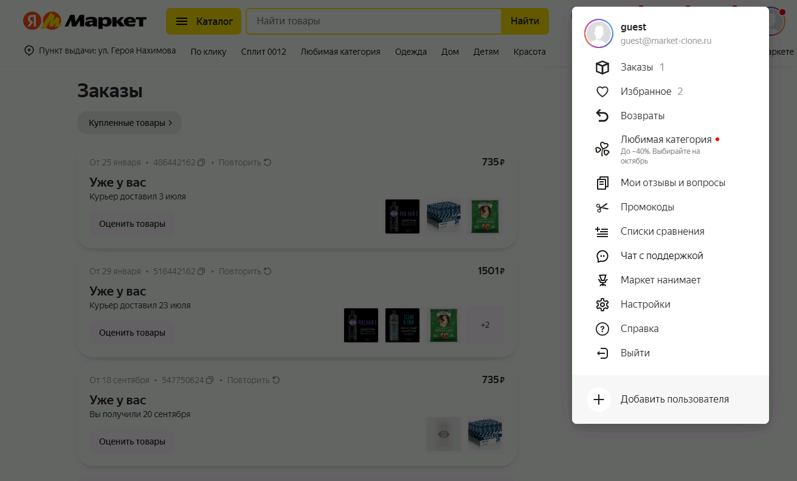
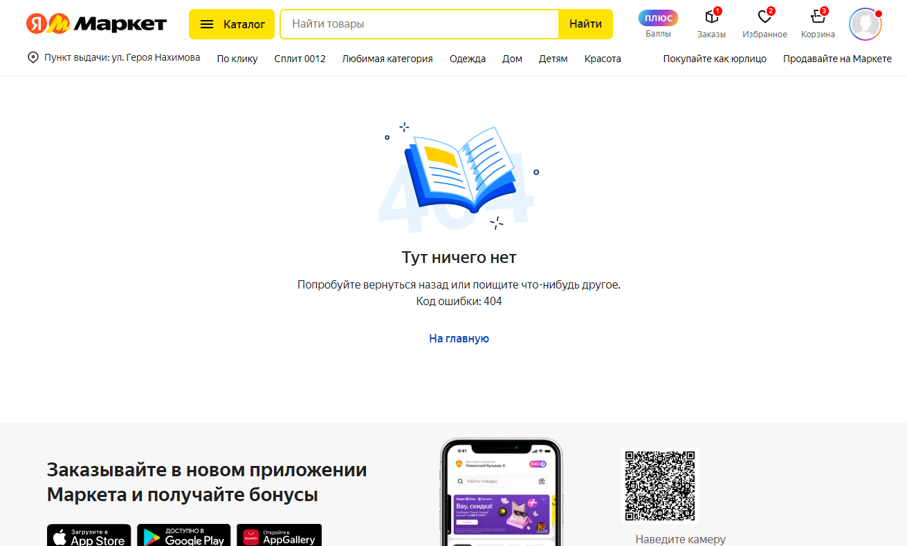
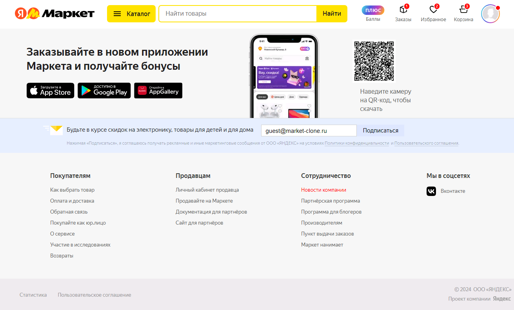

# Market-clone

[![Vercel Status][vercel-image]][vercel-url] [![Build Storybook Status][storybook-image]][storybook-url] [![CI Status][ci-image]][ci-url]

Storybook: [g-serg-work.github.io/market-clone](https://g-serg-work.github.io/market-clone)

API: [market-clone-api.vercel.app](https://market-clone-api.vercel.app)

## ScreenShots

  
  
  
  
  
  
  

## Introduction

The project is a visual copy of the famous online store [market.yandex.ru](https://market.yandex.ru)

Created for educational purposes.Tries to present some of the best tools in the React ecosystem with a good project structure, which is very well scalable.

The goal here is to serve as a collection of resources and the best practices in the development of React applications. Supposed, that this will demonstrate the solution to most real problems of the application in practice and will help developers. Write the best applications.

Feel free to study the code’s code base in order to extract maximum benefits from the repository.

## Table Of Contents:

-   [⚙️ Project Standards](docs/project-standards.md)
-   [🔧 Project Configure](docs/project-configure.md)
-   [🗄️ Project Structure](docs/project-structure.md)
-   [🧱 Components And Styling](docs/components-and-styling.md)
-   [📡 API Layer](docs/api-layer.md)
-   [🧪 Testing](docs/testing.md)
-   [⚠️ Error Handling](docs/error-handling.md)
-   [🌐 Deployment](docs/deployment.md)

[vercel-image]: https://vercelbadge.vercel.app/api/g-serg-work/market-clone
[vercel-url]: https://github.com/g-serg-work/market-clone/deployments/Production
[storybook-image]: https://github.com/g-serg-work/market-clone/actions/workflows/deploy-storybook.yml/badge.svg
[storybook-url]: https://github.com/g-serg-work/market-clone/actions/workflows/deploy-storybook.yml
[ci-image]: https://github.com/g-serg-work/market-clone/actions/workflows/CI.yml/badge.svg
[ci-url]: https://github.com/g-serg-work/market-clone/actions/workflows/CI.yml
