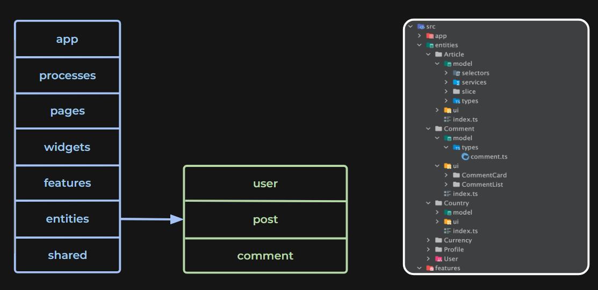

# 🗄️ Project Structure

The project is written in accordance with the methodology [Feature sliced design](https://feature-sliced.design/docs/get-started/tutorial)

Most of the code lives in the `src` folder and looks something like this:

```sh

src
|
+-- app
|   +-- hooks
|   +-- providers
|   +-- styles
|   +-- types
|
+-- features
|   +-- ...
|
+-- pages
|   +-- ...
|
+-- shared
|   +-- api
|   +-- assets
|   +-- config
|   +-- const
|   +-- eventChannels
|   +-- lib
|   +-- types
|   +-- ui
|
+-- widgets
|   +-- ...
|
+-- index.tsx
```

You might also want to enforce unidirectional codebase architecture. This means that the code should flow in one direction, from shared parts of the code to the application. This is a good practice to follow as it makes the codebase more predictable and easier to understand.



As you can see, the shared parts can be used by any part of the codebase, but the features can only import from shared parts and the app can import from features and shared parts.

To enforce this, you can use ESLint:

```js
'feature-sliced-project/relative-import-check': [
    'error',
    {
        alias: '@',
    },
],
'feature-sliced-project/import-only-underlying': [
    'error',
    {
        alias: '@',
        ignoreImportPatterns: ['**/StoreProvider', '**/testing'],
    },
],
'feature-sliced-project/public-api-import': [
    'error',
    {
        alias: '@',
        testFilesPatterns: ['**/*.test.*', '**/*.story.*', '**/StoreDecorator.tsx'],
    },
],

```

By following these practices, you can ensure that your codebase is well-organized, scalable, and maintainable. This will help you and your team to work more efficiently and effectively on the project.
